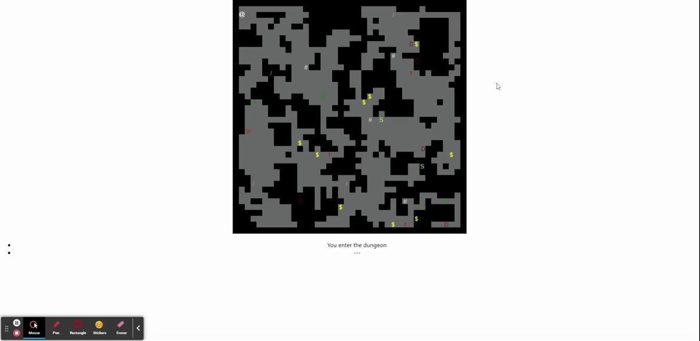
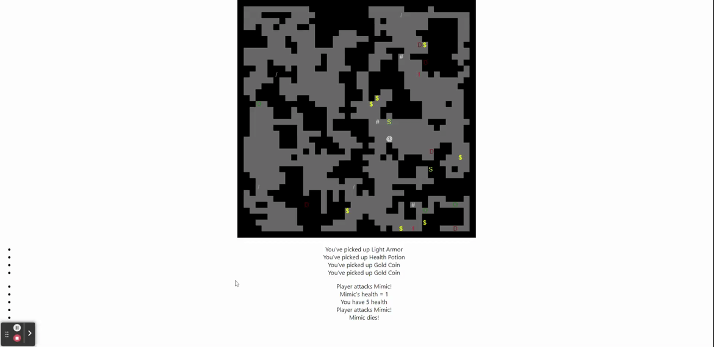

# Basic Roguelike
*A small game made using React.js under the guidance of [Morgan Page](https://github.com/morganpage)*

---

## Index
- [Concept](#Concept)
- [Process](#Process)
- [Challenges vs. Sucesses](#challenges-vs-successes)
- [Demo Gifs/Photos](#demo-gifsphotos)
- [Future Development](#future-development)
- [Links](#Links)

## Concept
As someone who loves roguelikes and has been interested game development, using React to make a basic roguelike seemed like a no brainer. This is a simple game to cement the understanding of basic game logic, implementing react hooks, and utilizing react components while creating something fun.

## Process
I began with the standard `create-react-app` command, and ran my app just to ensure that it worked. It was a good thing that I did because instead of displaying the generic new react app screen, I was met with an app I worked on 9 months ago. After some troubleshooting and removing a pesky service worker, I was ready to begin. I started with a basic canvas to create my game board. I created a hook to add this canvas to the screen with the parameters specified. Next was adding a player to the board. I began with a small square, but in the spirit of roguelikes, later changed it to an `@` symbol. Logic was added to move the player around the world, and by that token, logic to give him a world to move around in. I used [rot-js](https://ondras.github.io/rot.js/hp/), an open source set of js libraries, to handle my map generating. Next was creating entities - the loot, monsters, player, etc. To track the entities, I added a written history log and an inventory list. Last, I created a staircase with accompanying logic to move the player to another floor while maintaining his stats and inventory.

## Challenges vs. Successes
| Challenges | Successes |
| ----------- | ----------- |
| Collision detection | Using destructuring for cleaner code |
| Getting the stairs to appear | Breaking the app into small steps |
| Spawning character and items in reasonable locations | Fixing bugs quickly and efficiently along the way |

## Demo Gifs/Photos
Here, we can see the character spawning in the top left corner of the screen, outside of a wall. He can move through the map, grab items, and fight monsters

Next, we can see that the player's health is tracked. So if his health reaches zero, he can no longer move. Simliarly, when the monster's health reaches zero, it is removed from the game board

## Future Development
I plan to add indicators to the screen for the players stats, make the game more mobile responsive/friendly, increase the player's stats when items like weapons or armor are picked up, replace the ascii characters with handdrawn elements, and potentially add some music to the background. Once all of this is done, I'll be deploying it most likely using Heroku.

## Links
- [Repo Link](https://github.com/zimcrom/basic-roguelike)
- Site will be deployed in the future

